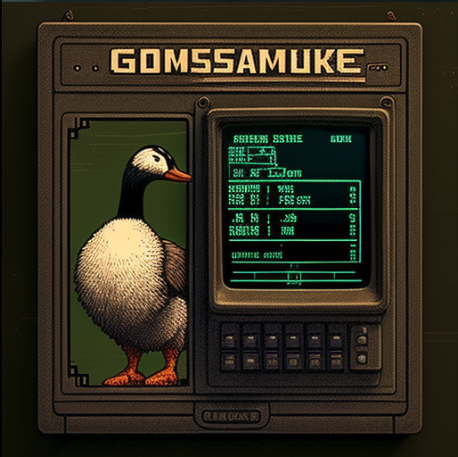

# Goose

A simple CLI to interact with the [mpl-migration-validator](https://github.com/metaplex-foundation/mpl-migration-validator) program.

## Deprecated

With the closing of the pNFT migration on May 31st, Goose is now deprecated.